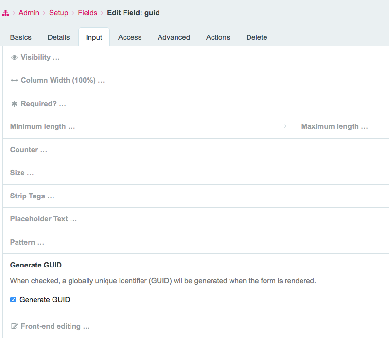
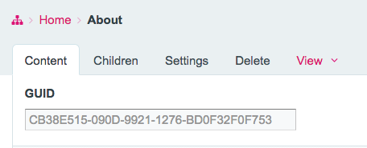

# ProcessWire GUID Generator (Fork)

**Designed (tested) for use with ProcessWire 3.0.247**

## Description

Generate a globally unique identifier (GUID) from within a single Inputfield **Text**.

**NEW** The GUID/UUID is now generated when a page is **created** and is unique for the field.
Prior function to generate a GUID/UUID when field form was rendered the first time still exists
It is not possible to change the GUID/UUID after the page has been created.

## Features

- Standard UUID/GUID format (xxxxxxxx-xxxx-xxxx-xxxx-xxxxxxxxxxxx)
- 32-digit alphanumeric format
- 64-digit alphanumeric format
- 128-digit alphanumeric format
- Optional prefix for all identifier formats (default: "GUID-")
- Automatic generation on page creation
- Guaranteed uniqueness within the field

## Installation

1. Copy the module files to the `site/modules` directory.
2. Refresh the module cache from the admin panel.
3. Install the module from the admin panel.
4. Create a new field of type **Text**.
5. Enable the **Generate GUID** option.

## Usage

For each instance of a text field the field settings will be extended. Navigate to *Admin > Setup > Fields* and edit the desired field. Click on the Input Tab and click on the **"Generate GUID"** area.
It extends downwards and reveals a form to enable automatic GUID generation.

After having enabled GUID generation for a text field, edit a page which has a template containing this field.
You'll see the field filled with a GUID.

## Requirements

- ProcessWire>=3.0.247
- PHP>=8.2

Those are the versions the fork was tested with.

## License

MIT License [see LICENSE](LICENSE)
